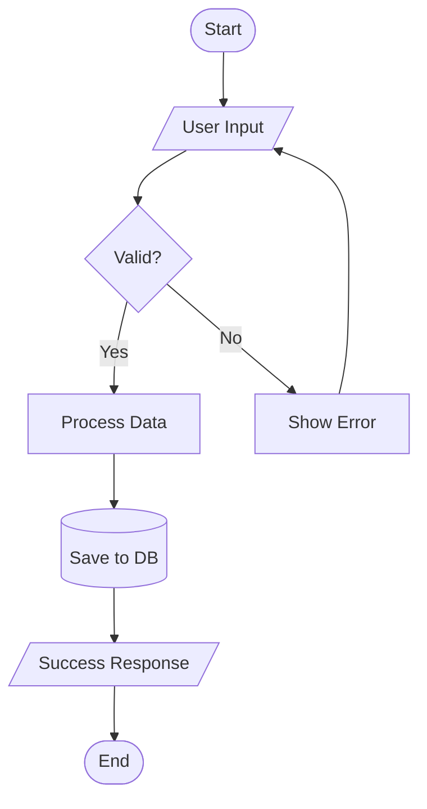
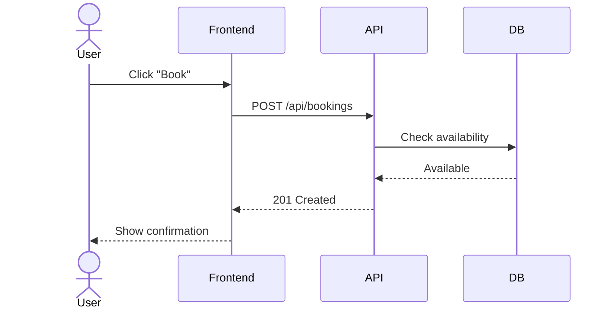
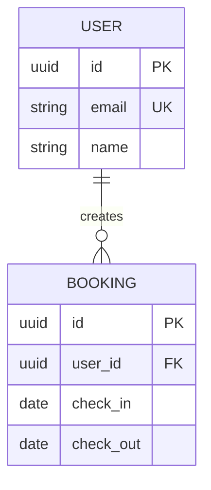
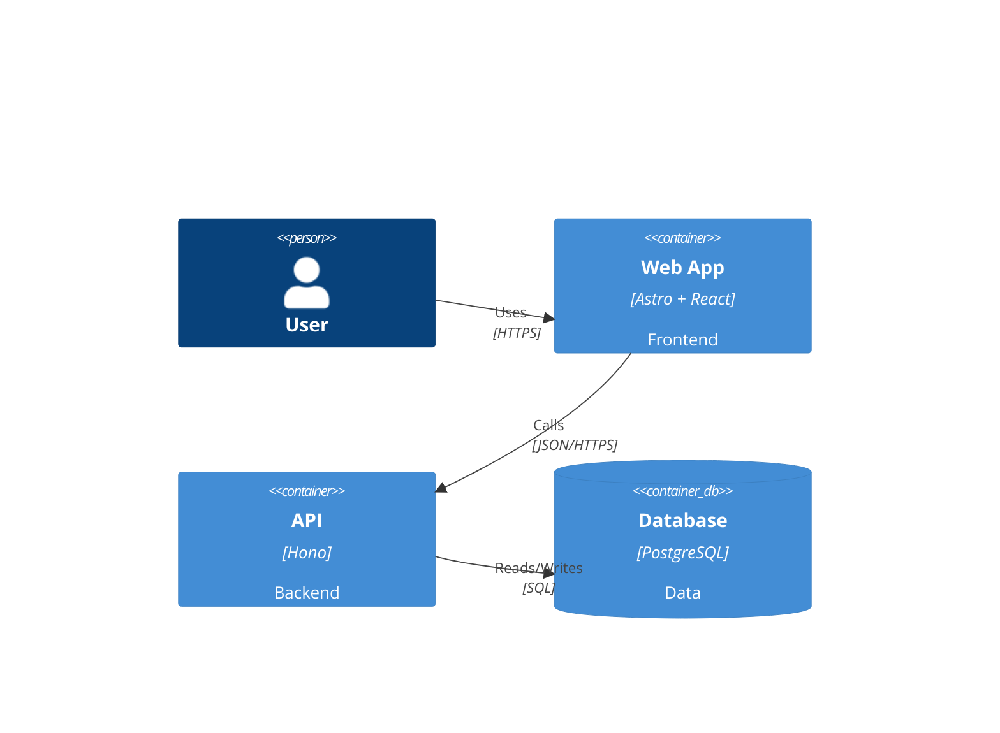
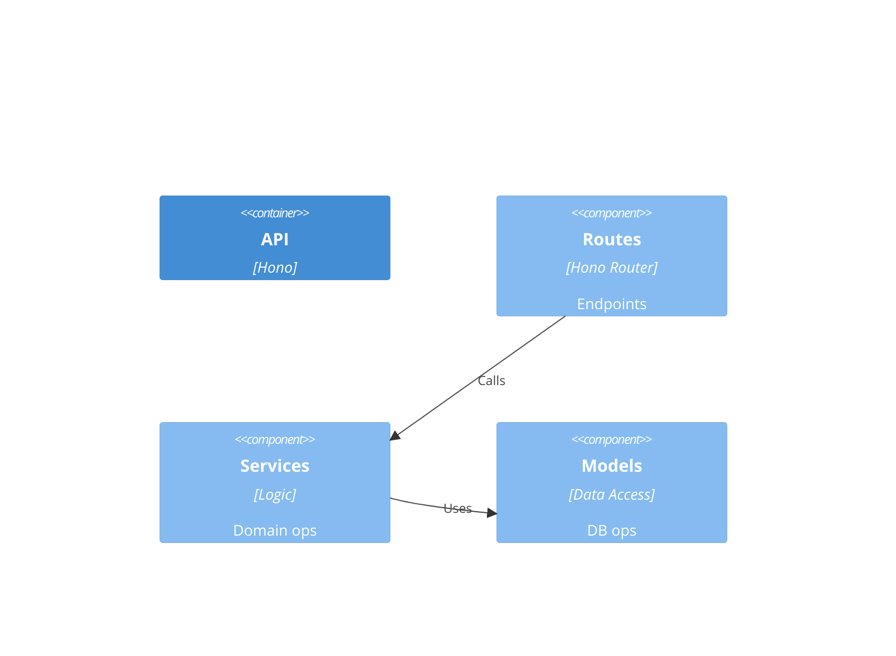
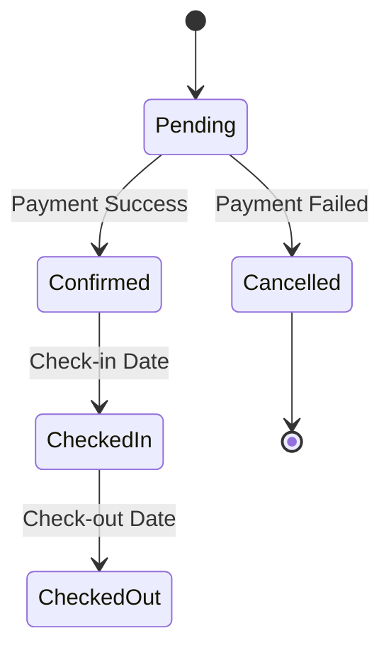
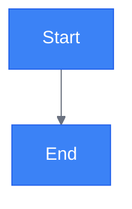
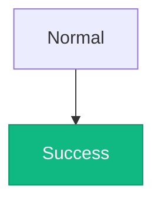
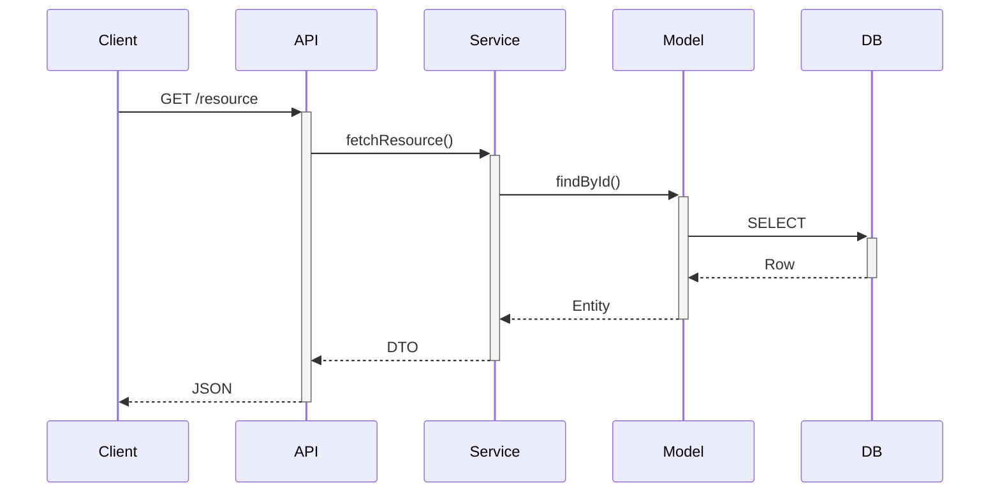
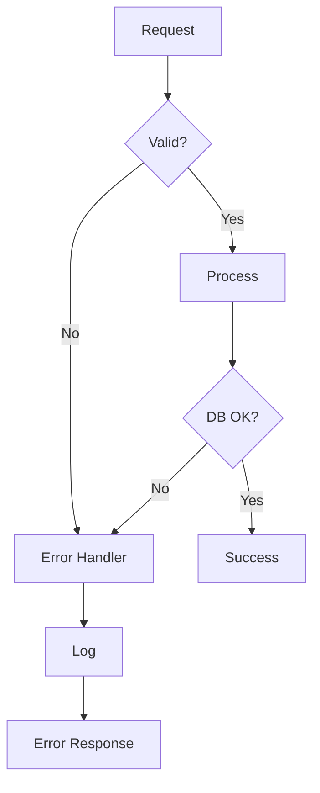

# Mermaid Syntax Reference

## Flowchart



**Node shapes:** `[Rectangle]` process, `([Rounded])` start/end, `{Diamond}` decision, `[/Parallelogram/]` I/O, `[(Database)]` storage, `((Circle))` connector.

**Directions:** `TD` top-down, `LR` left-right, `BT` bottom-up, `RL` right-left.

## Sequence Diagram



**Participant types:** `actor` human, `participant` system, `database` DB.
**Arrows:** `->` sync, `-->` response, `->>` async, `-->>` async response.

## ERD



**Relationships:** `||--||` one-to-one, `||--o{` one-to-many, `}o--o{` many-to-many, `||--o|` one-to-zero-or-one.
**Cardinality:** `||` exactly one, `o|` zero or one, `}o` zero or more, `}|` one or more.

## C4 Architecture

**Context level** — system in environment:

```mermaid
C4Context
    title System Context
    Person(guest, "Guest", "Tourist")
    System(platform, "Platform", "Booking system")
    System_Ext支付, "Payment", "Processor")
    Rel(guest, platform, "Books", "HTTPS")
    Rel(platform,支付, "Processes", "API")
```

**Container level** — applications and data stores:



**Component level** — internal structure:



## State Diagram



## Styling



**Class styling:**



## Common Patterns

**API request flow:**



**Error handling flow:**


