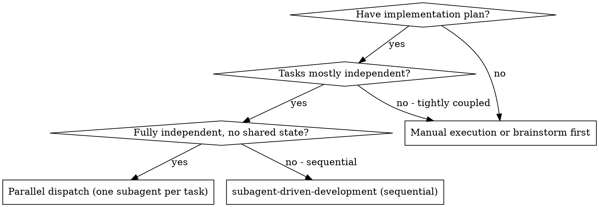
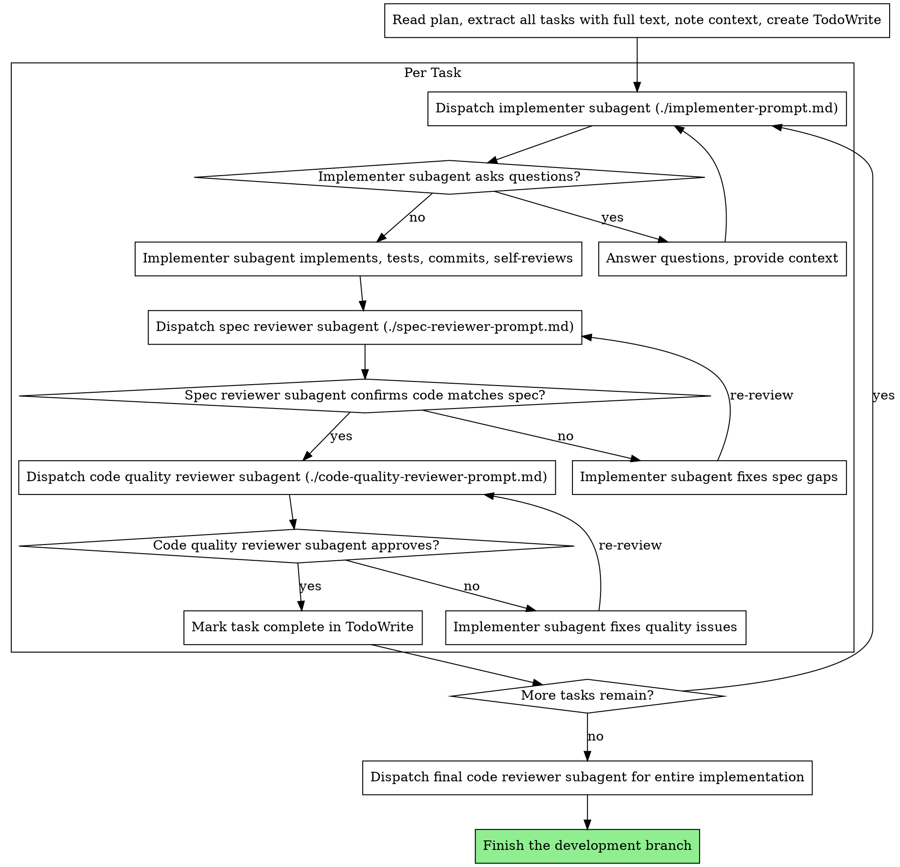

# Subagent-Driven Development

Execute plan by dispatching fresh subagent per task, with two-stage review after each: spec compliance review first, then code quality review.

**Why subagents:** You delegate tasks to specialized agents with isolated context. By precisely crafting their instructions and context, you ensure they stay focused and succeed at their task. They should never inherit your session's context or history — you construct exactly what they need. This also preserves your own context for coordination work.

**Core principle:** Fresh subagent per task + two-stage review (spec then quality) = high quality, fast iteration

**Continuous execution:** Do not pause to check in with your human partner between tasks. Execute all tasks from the plan without stopping. The only reasons to stop are: BLOCKED status you cannot resolve, ambiguity that genuinely prevents progress, or all tasks complete. "Should I continue?" prompts and progress summaries waste their time — they asked you to execute the plan, so execute it.

## When to Use



**Three execution modes:**
- **Sequential (default):** fresh subagent per task, two-stage review after each. For plans whose tasks share state or build on each other.
- **Parallel dispatch:** one subagent per fully-independent problem domain, run concurrently. See [Parallel Dispatch](#parallel-dispatch).
- **Inline fallback:** no subagents available — execute the plan yourself. See [Inline Fallback](#inline-fallback-no-subagents).

## The Process



## Model Selection

Use the least powerful model that can handle each role to conserve cost and increase speed.

**Mechanical implementation tasks** (isolated functions, clear specs, 1-2 files): use a fast, cheap model. Most implementation tasks are mechanical when the plan is well-specified.

**Integration and judgment tasks** (multi-file coordination, pattern matching, debugging): use a standard model.

**Architecture, design, and review tasks**: use the most capable available model.

**Task complexity signals:**
- Touches 1-2 files with a complete spec → cheap model
- Touches multiple files with integration concerns → standard model
- Requires design judgment or broad codebase understanding → most capable model

## Handling Implementer Status

Implementer subagents report one of four statuses. Handle each appropriately:

**DONE:** Proceed to spec compliance review.

**DONE_WITH_CONCERNS:** The implementer completed the work but flagged doubts. Read the concerns before proceeding. If the concerns are about correctness or scope, address them before review. If they're observations (e.g., "this file is getting large"), note them and proceed to review.

**NEEDS_CONTEXT:** The implementer needs information that wasn't provided. Provide the missing context and re-dispatch.

**BLOCKED:** The implementer cannot complete the task. Assess the blocker:
1. If it's a context problem, provide more context and re-dispatch with the same model
2. If the task requires more reasoning, re-dispatch with a more capable model
3. If the task is too large, break it into smaller pieces
4. If the plan itself is wrong, escalate to the human

**Never** ignore an escalation or force the same model to retry without changes. If the implementer said it's stuck, something needs to change.

## Prompt Templates

- `./implementer-prompt.md` - Dispatch implementer subagent
- `./spec-reviewer-prompt.md` - Dispatch spec compliance reviewer subagent
- `./code-quality-reviewer-prompt.md` - Dispatch code quality reviewer subagent

## Example Workflow

A full end-to-end trace (you → implementer → spec reviewer → code
reviewer, two tasks) is in `references/example-workflow.md` — read it for
a concrete walkthrough.

## Advantages

**vs. Manual execution:**
- Subagents follow TDD naturally
- Fresh context per task (no confusion)
- Parallel-safe (subagents don't interfere)
- Subagent can ask questions (before AND during work)

**vs. inline execution:**
- Fresh context per task (no pollution)
- Review checkpoints automatic
- Continuous progress (no waiting)

**Efficiency gains:**
- No file reading overhead (controller provides full text)
- Controller curates exactly what context is needed
- Subagent gets complete information upfront
- Questions surfaced before work begins (not after)

**Quality gates:**
- Self-review catches issues before handoff
- Two-stage review: spec compliance, then code quality
- Review loops ensure fixes actually work
- Spec compliance prevents over/under-building
- Code quality ensures implementation is well-built

**Cost:**
- More subagent invocations (implementer + 2 reviewers per task)
- Controller does more prep work (extracting all tasks upfront)
- Review loops add iterations
- But catches issues early (cheaper than debugging later)

## Red Flags

**Never:**
- Start implementation on main/master branch without explicit user consent
- Skip reviews (spec compliance OR code quality)
- Proceed with unfixed issues
- Dispatch multiple implementation subagents in parallel (conflicts)
- Make subagent read plan file (provide full text instead)
- Skip scene-setting context (subagent needs to understand where task fits)
- Ignore subagent questions (answer before letting them proceed)
- Accept "close enough" on spec compliance (spec reviewer found issues = not done)
- Skip review loops (reviewer found issues = implementer fixes = review again)
- Let implementer self-review replace actual review (both are needed)
- **Start code quality review before spec compliance is ✅** (wrong order)
- Move to next task while either review has open issues

**If subagent asks questions:**
- Answer clearly and completely
- Provide additional context if needed
- Don't rush them into implementation

**If reviewer finds issues:**
- Implementer (same subagent) fixes them
- Reviewer reviews again
- Repeat until approved
- Don't skip the re-review

**If subagent fails task:**
- Dispatch fix subagent with specific instructions
- Don't try to fix manually (context pollution)

## Parallel Dispatch

When tasks are **fully independent** — different subsystems, different files, no shared state — dispatch one subagent per problem domain and run them concurrently instead of task-by-task. Typical trigger: several unrelated test files or subsystems broken independently.

**Use when:** each problem can be understood without context from the others, and agents won't edit the same code.

**Don't use when:** failures are related (fixing one may fix others), you need full system state, or agents would touch shared files.

**Pattern:**

1. **Group by independent domain.** One subagent per domain (e.g. one per failing test file / subsystem).
2. **Write focused prompts.** Each is self-contained: specific scope, clear goal, constraints ("don't change other code"), and the exact output you want back. Paste the real error messages and test names — never "fix the race condition".
3. **Dispatch concurrently.** Launch all subagents in one batch.
4. **Review and integrate.** Read each summary, check for conflicting edits, run the full suite, spot-check for systematic errors.

**Prompt smells:** too broad ("fix all the tests"), no context ("fix the race condition"), no constraints (agent refactors everything), vague output ("fix it"). Each is fixed by being specific.

**Good agent prompt structure** — focused, self-contained, specific about output:

```markdown
Fix the 3 failing tests in src/agents/agent-tool-abort.test.ts:

1. "should abort tool with partial output capture" - expects 'interrupted at' in message
2. "should handle mixed completed and aborted tools" - fast tool aborted instead of completed
3. "should properly track pendingToolCount" - expects 3 results but gets 0

These are timing/race condition issues. Your task:

1. Read the test file and understand what each test verifies
2. Identify root cause - timing issues or actual bugs?
3. Fix by:
   - Replacing arbitrary timeouts with event-based waiting
   - Fixing bugs in abort implementation if found
   - Adjusting test expectations if testing changed behavior

Do NOT just increase timeouts - find the real issue.

Return: Summary of what you found and what you fixed.
```

**Common mistakes:**

- ❌ Too broad: "Fix all the tests" — agent gets lost. ✅ Specific: name the file.
- ❌ No context: "Fix the race condition" — agent doesn't know where. ✅ Paste the error messages and test names.
- ❌ No constraints: agent might refactor everything. ✅ "Do NOT change production code" / "Fix tests only".
- ❌ Vague output: "Fix it" — you don't know what changed. ✅ "Return summary of root cause and changes".

**When NOT to use parallel dispatch:** failures are related (fixing one may fix others); you need full system state; exploratory debugging where you don't yet know what's broken; or agents would interfere (editing the same files, using the same resources).

**Real example:** 6 test failures across 3 files after a refactor — `agent-tool-abort.test.ts` (3 timing failures), `batch-completion-behavior.test.ts` (2, tools not executing), `tool-approval-race-conditions.test.ts` (1, execution count = 0). Dispatched 3 agents concurrently; fixes were independent, zero conflicts, full suite green.

## Inline Fallback (no subagents)

If the platform has no subagents, execute the plan yourself in-session:

1. **Load and review the plan critically.** Identify gaps or concerns; raise them with your human partner before starting. If clean, create a TodoWrite and proceed.
2. **Execute each task** in order: mark in-progress, follow the plan's bite-sized steps exactly, run the verifications it specifies, mark complete.
3. **Stop and ask — don't guess —** on any blocker: missing dependency, failing test, unclear instruction, or repeated verification failure.
4. **Finish** the development branch — verify tests, then offer merge / PR / keep / discard.

Never start implementation on main/master without explicit user consent.

## Integration

**Required workflow steps:**
- Use an isolated worktree (create one or verify an existing one).
- A plan this skill executes (created up front by whoever is driving the work).
- Code review — request a review of the completed work.
- Finish the development branch (verify tests, then offer merge / PR / keep / discard).

**Subagents should use:**
- **test-driven-development** - Subagents follow TDD for each task
