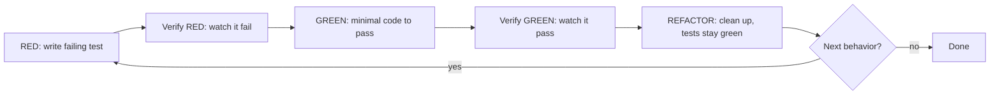

# RED → GREEN → REFACTOR cycle



## Loop rules

- **RED first, always.** No production code without a failing test first.
- **Verify at every phase.** Watch it fail; watch it pass. "Should pass" is not a verification.
- **REFACTOR only after GREEN.** Never refactor before the test passes.
- **One behavior per loop.** Each pass through the cycle adds one behavior, one test, one minimal implementation.

## Worked example (TypeScript)

**RED:**
```typescript
test('retries failed operations 3 times', async () => {
  let attempts = 0;
  const operation = () => { attempts++; if (attempts < 3) throw new Error('fail'); return 'success'; };
  const result = await retryOperation(operation);
  expect(result).toBe('success'); expect(attempts).toBe(3);
});
```

Avoid `<Bad>` tests — mocks and vague names don't exercise behavior.

**GREEN:**
```typescript
async function retryOperation<T>(fn: () => Promise<T>): Promise<T> {
  for (let i = 0; i < 3; i++) { try { return await fn(); } catch (e) { if (i === 2) throw e; } }
  throw new Error('unreachable');
}
```

