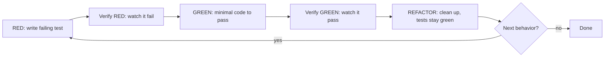

# RED → GREEN → REFACTOR cycle

## Loop rules

- **RED first, always.** No production code without a failing test first.
- **Verify at every phase.** Watch it fail; watch it pass. "Should pass" is not a verification.
- **REFACTOR only after GREEN.** Never refactor before the test passes.
- **One behavior per loop.** Each pass through the cycle adds one behavior, one test, one minimal implementation.
