# tufte-data-viz

An agent skill that applies [Edward Tufte's](https://www.edwardtufte.com/) data visualization principles when generating charts, plots, and graphs. Produces clean, honest, high-data-ink-ratio visualizations across multiple charting libraries — extended with modern screen-first standards for accessibility, responsiveness, and interactivity.

## Fair warning

This skill is **opinionated by design**. It will remove your gridlines, delete your legends, reject your pie charts, and insist on serif fonts. It enforces a specific visual philosophy — Tufte's — not a neutral one. If you want total creative freedom over your chart styling, this is not the skill for you. If you want every chart to come out clean, honest, and readable without thinking about it, read on.

## Install

Install via this catalog (the top-level `README.md` covers the symlink
install into both `~/.copilot/skills` and `~/.config/opencode/skills`);
or copy the `tufte-data-viz/` folder into your harness's skills
directory.

## Before & After

The same data, default styling vs. Tufte principles applied:

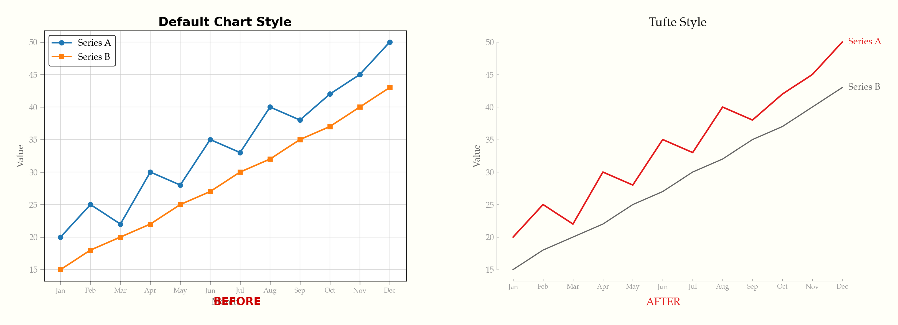

See it happen live — gridlines fade, legends become direct labels, chartjunk dissolves:

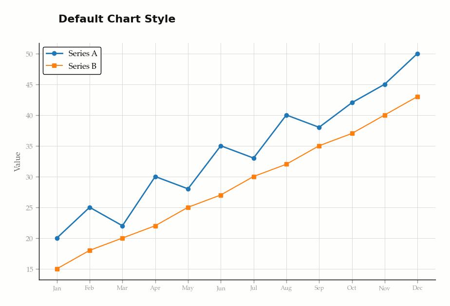

## Interactive Demo

A self-contained interactive demo is bundled at `docs/index.html`
(open it in a browser) — toggle between default and Tufte styling
across ECharts, Chart.js, Plotly, and D3.js, including dark mode.

## Examples

### Line chart — direct labels, range-frame axes, annotation

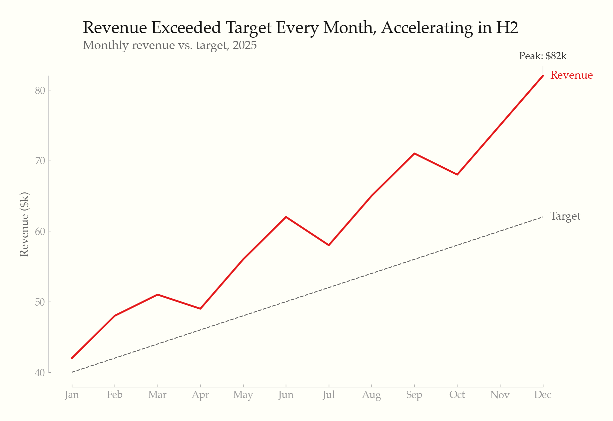

### Horizontal bar chart — sorted by value, highlighted leader

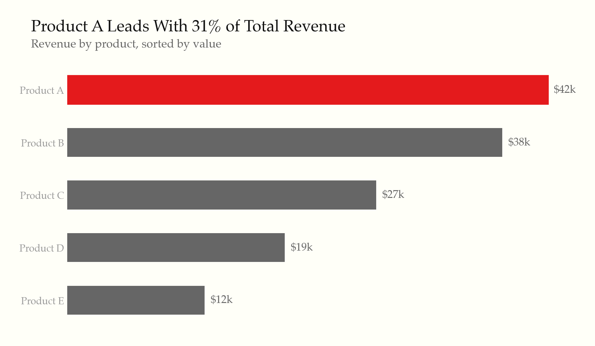

### Slopegraph — before/after comparison

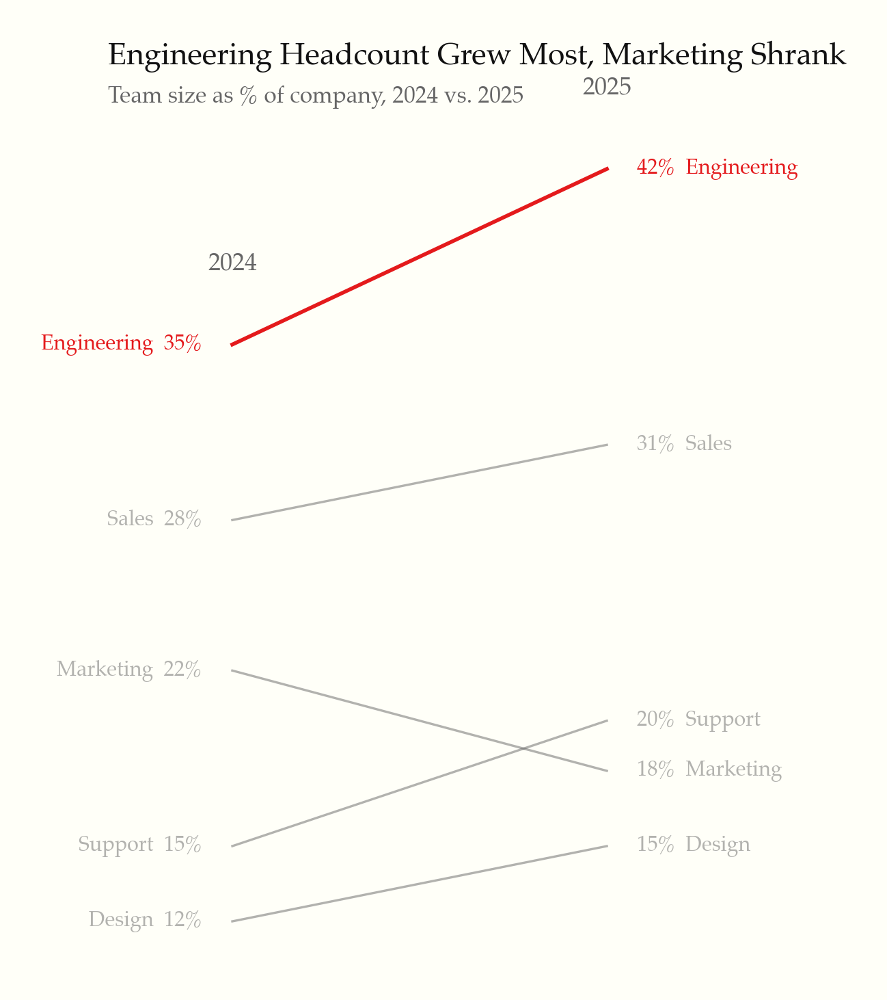

### Small multiples — shared scale, minimal chrome

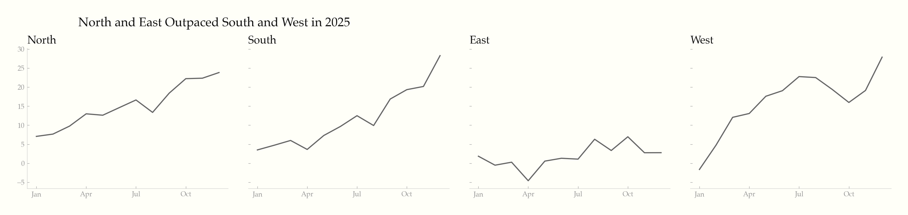

### Sparklines — word-sized charts with min/max markers

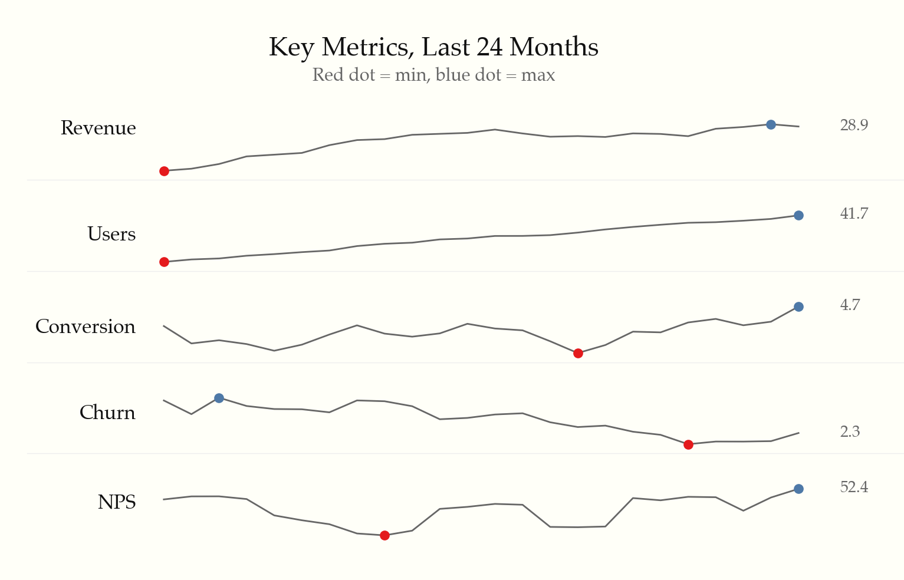

### Data table — whitespace, thin rules, highlighted outlier

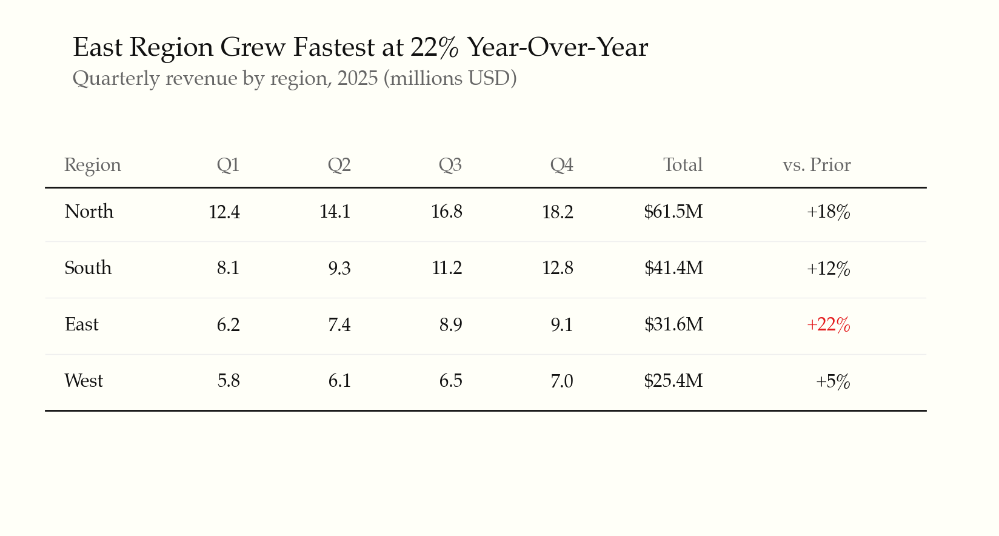

### Dark mode — intentional palette, not inverted

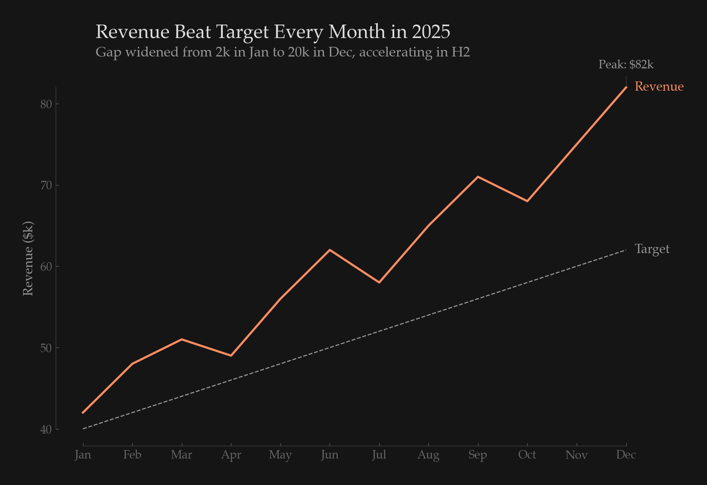

### Accessible scatter — dual-encoded with shape + color

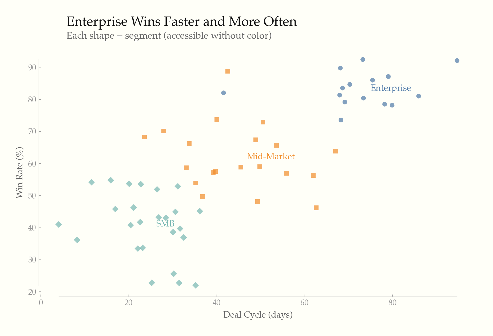

### Light & dark — same chart, both themes

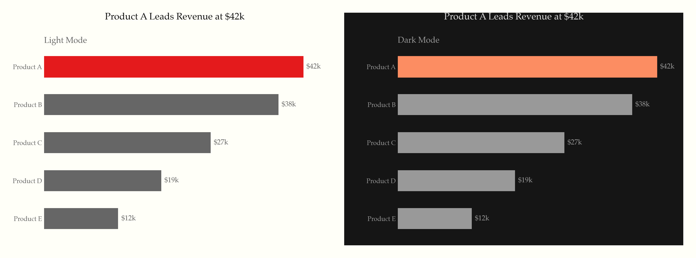

## What it does

22 universal rules applied to every chart, organized in three tiers:

**Static principles (rules 1–14)** — the Tufte foundation:
- Maximize data-ink ratio — remove gridlines, borders, legends, and decoration that don't convey data
- Direct labeling, range-frame axes, no 3D, no pie charts (unless forced), no dual y-axes
- Serif typography, off-white backgrounds, gray as primary color with selective highlighting
- Annotate notable features, show comparison context, minimal tooltips

**Screen-first principles (rules 15–19)** — modern interactive contexts:
- Progressive disclosure (overview first, details on hover/tap/click)
- WCAG accessibility (contrast ratios, dual encoding, keyboard nav, screen reader text alternatives)
- Responsive design (fluid/adaptive strategies, touch targets, mobile-adapted chart types)
- Purposeful animation (data transitions only, respect `prefers-reduced-motion`)
- Intentional dark mode (semantic color tokens, never invert, reduce saturation)

**Content & formatting (rules 20–22)** — what Tufte assumed but never codified:
- Titles assert findings ("Revenue Surged 23%"), not axis descriptions
- Numbers formatted for humans ($1.2M, thousand separators, matched precision)
- Don't chart what a sentence or table can say better

## Supported libraries

| Library | Rule file | Language |
|---------|-----------|----------|
| [Recharts](https://recharts.org/) | `rules/recharts.md` | React/JSX |
| [ECharts](https://echarts.apache.org/) | `rules/echarts.md` | JavaScript |
| [Chart.js](https://www.chartjs.org/) | `rules/chartjs.md` | JavaScript |
| [matplotlib](https://matplotlib.org/) | `rules/matplotlib.md` | Python |
| [Plotly](https://plotly.com/) | `rules/plotly.md` | Python/JS |
| D3.js / SVG / HTML | `rules/svg-html.md` | Web |

## Additional references

- `rules/interactive-and-accessible.md` — progressive disclosure, accessibility, responsive, animation, dark mode
- `rules/typography-and-color.md` — font stacks, palettes, hex values
- `rules/anti-patterns.md` — common violations and one-liner fixes
- `rules/small-multiples-sparklines.md` — small multiples, sparklines, slopegraphs

## Based on

- *The Visual Display of Quantitative Information* (1983)
- *Envisioning Information* (1990)
- *Visual Explanations* (1997)
- *Beautiful Evidence* (2006)

## License

MIT
